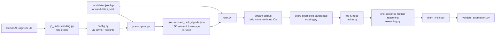
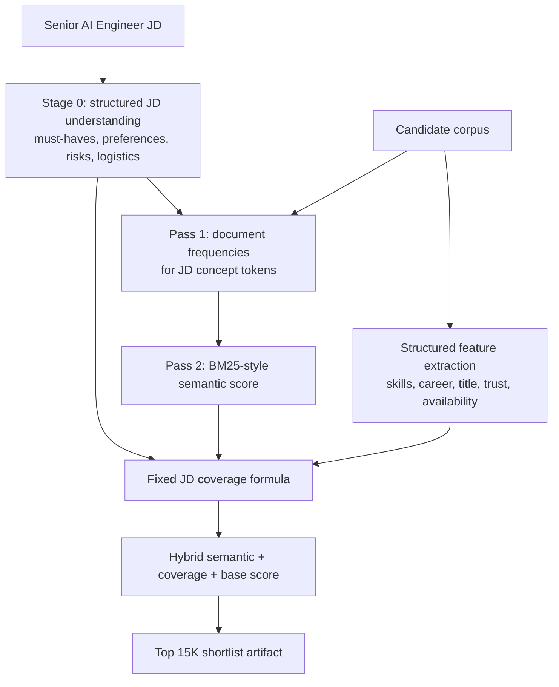
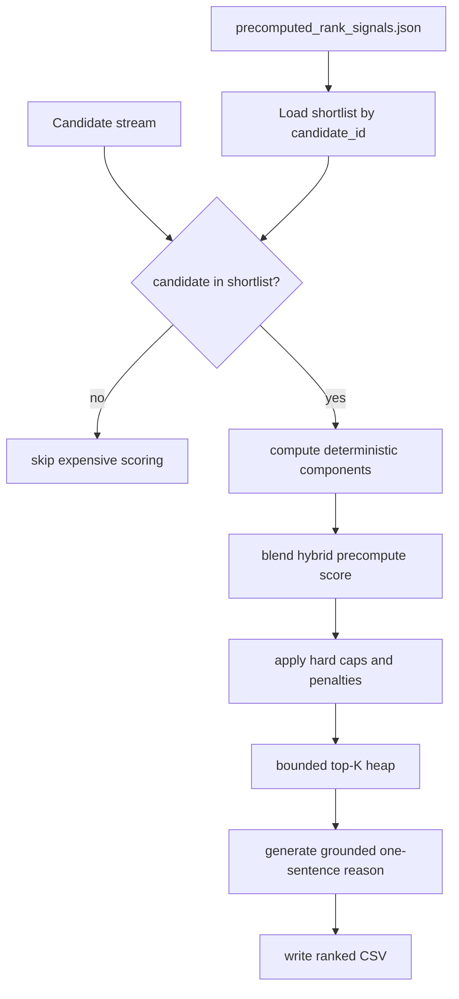
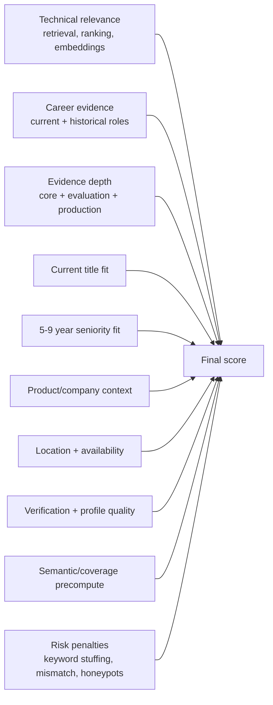
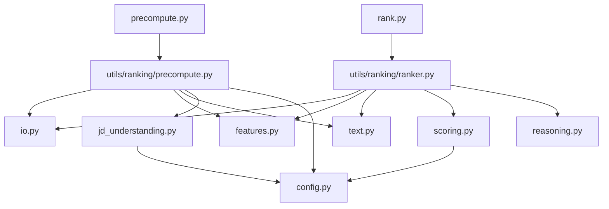

# jinsil

Hybrid offline candidate ranking system for the Redrob Intelligent Candidate
Discovery & Ranking Challenge.

## Proposed Solution

Jinsil is a transparent candidate ranking engine for a Senior AI Engineer
founding-team role. It combines an offline precompute stage with a fast
deterministic ranking stage. The first step is a structured JD understanding:
the role mandate, must-have evidence, preferred signals, logistics, and negative
signals are encoded before any candidate is scored. The precompute stage then
uses that JD profile to build semantic retrieval and fixed JD coverage signals.
The ranking stage streams the candidate file, combines those deterministic
signals with structured profile evidence, and outputs the top candidates with
scores and human-readable reasoning.

The system remains CPU-only, no-network, and reproducible. Precompute does not
train on candidate data: it first interprets the JD into a fixed role profile,
then computes corpus-level retrieval statistics and applies JD-derived coverage
weights stored in code.

## What Makes It Different

Traditional candidate matching often behaves like resume keyword search: it
rewards profiles that repeat terms from the JD, even when the candidate has not
actually shipped relevant systems. Jinsil uses a hybrid architecture: BM25-style
semantic retrieval, fixed JD coverage scoring, structured evidence scoring,
and deterministic explanation.

The ranker separates strong signals from weak ones. For example, a candidate who
has built production retrieval or ranking systems, evaluated relevance with NDCG
or offline benchmarks, and worked in product/recruiter workflows scores higher
than someone who merely lists "AI", "LLM", or "machine learning" as skills.

It also uses negative evidence. Non-engineering current roles, consulting-only
career patterns, pure research without production delivery, unrelated AI domains
such as CV/speech/robotics, stale availability, and suspicious skill patterns are
explicitly down-ranked.

## Key JD Requirements Extracted

The role is treated as a hands-on Senior AI Engineer position for an early-stage
product team. The most important extracted requirements are:

- 5-9 years of engineering experience.
- Strong Python and production ML engineering.
- Direct experience with embeddings, retrieval, search, ranking, recommendation,
  matching, or reranking systems.
- Comfort with LLM/RAG-style systems, vector databases, BM25, hybrid search, or
  related relevance infrastructure.
- Ability to evaluate ranking quality using offline and online measures such as
  NDCG, MRR, MAP, A/B tests, feedback loops, and recruiter feedback.
- Evidence of production delivery: shipped systems, latency, scale, monitoring,
  observability, and quality regression handling.
- Product sense and ownership in workflows such as marketplace, recruiter, hiring,
  matching, or user-facing AI products.
- Mentoring, architecture, design review, and senior engineering judgment.
- India/location/logistics fit, reasonable notice period, responsiveness, and
  verified profile quality.

## Most Important Candidate Signals

The ranker evaluates candidate fit through multiple signal families:

- Technical relevance: profile text and skill evidence for Python, retrieval,
  ranking, embeddings, search, matching, recommendation systems, vector databases,
  BM25, hybrid search, LLM reranking, RAG, and evaluation metrics.
- Skill trust: proficiency, duration, endorsements, and Redrob skill assessment
  scores are combined so declared skills are not trusted blindly.
- Current role fit: hands-on AI, ML, search, backend, data, platform, or software
  engineering titles are preferred over management, sales, support, HR,
  operations, or business analyst titles.
- Career evidence: current and historical roles are scanned for shipped systems,
  production ownership, product context, evaluation infrastructure, and long
  tenures.
- Evidence depth: candidates are rewarded for combinations of current core
  retrieval evidence, broader career evidence, evaluation evidence, production
  evidence, product ownership, and leadership.
- Practical hireability: location, relocation, notice period, recency, response
  rate, response time, open-to-work status, interview completion, offer acceptance,
  and verification signals.
- Risk signals: keyword stuffing, unrelated AI background, low-quality profiles,
  suspicious skill claims, and career mismatch.

## Beyond Keyword Matching

Jinsil does use phrase detection, but only as one input to a structured scoring
system. A term hit by itself is not enough. The score is capped or penalized when
the profile lacks core retrieval/ranking evidence, lacks evaluation evidence, has
weak current-title fit, or does not show production delivery.

For example:

- "ML" inside unrelated text does not count as a real signal because short terms
  use boundary-aware matching.
- A long list of AI skills without production words like "built", "shipped",
  "deployed", or "production" receives a keyword-density penalty.
- Adjacent ML experience helps, but direct search/ranking/retrieval experience is
  weighted more heavily.
- Current role evidence matters more than stale historical mentions.

## Retrieval, Scoring, and Ranking

The workflow has two stages.

Offline precompute:

1. Build a structured JD understanding: role mandate, must-have technical proof,
   preferred evidence, logistics, ideal profile, and negative fit signals.
2. Convert that JD profile into query weights for retrieval, ranking, embeddings,
   evaluation, production, product ownership, and leadership concepts.
3. Scan the candidate corpus to compute document-frequency statistics for those
   concepts.
4. Score each candidate with BM25-style semantic relevance.
5. Compute structured fit features using the same profile, skill, career,
   availability, trust, and penalty signals used by the final ranker.
6. Apply fixed JD-derived coverage weights across semantic relevance, evidence
   depth, production/evaluation coverage, title fit, and risk penalties.
7. Write `precomputed_rank_signals.json` with semantic, coverage, and hybrid scores for
   the strongest 15,000-candidate shortlist.

Final ranking:

1. Stream candidates from JSON, JSONL, or gzipped input.
2. Load the precompute artifact by candidate ID.
3. Skip candidates outside the precomputed shortlist.
4. Compute deterministic component scores for shortlisted candidates.
5. Blend the precomputed hybrid signal as a bounded reranking feature.
6. Apply mismatch, suspicious-profile, keyword-stuffing, and weak-production
   penalties.
7. Calibrate the final score to avoid saturation and preserve score separation.
8. Keep only a bounded heap of top candidates in memory.
9. Sort the retained candidates and write the top ranked output CSV.

This approach avoids loading the full dataset into memory and scales to large
candidate files on CPU.

## Algorithms and Heuristics Used

The ranking system is a hybrid retrieval and ranking ensemble, implemented in
plain Python:

- BM25-style semantic retrieval over JD-focused concept tokens.
- Fixed JD coverage scoring with hand-set weights.
- Whole-phrase text matching with cached regular expressions for short ambiguous
  tokens.
- Structured feature extraction from profile, skills, career history, and
  Redrob behavioral signals.
- Weighted component scoring for technical, career, title, seniority, product,
  location, engagement, and trust dimensions.
- Evidence-depth scoring to reward combinations of JD-shaped proof.
- Penalty scoring for mismatch and low-quality profiles.
- Multiplicative hireability adjustment based on engagement and trust.
- Final score calibration using a fixed scale factor.
- Min-heap top-K ranking for memory efficiency.

No external ML framework is required and no model is trained on candidate data.
The precompute artifact is produced by fixed retrieval and coverage formulas.

## Combining Signals Into Final Ranking

The deterministic base score is built from weighted components:

- Technical relevance: 25%
- Career evidence: 16%
- Evidence depth: 14%
- Current title fit: 11%
- Seniority fit: 11%
- Product/company context: 8%
- Location/logistics: 6%
- Engagement/availability: 7%
- Trust/profile quality: 2%

Penalties are subtracted before the hireability multiplier is applied. The
offline hybrid score then contributes as a bounded reranking feature, so semantic
and fixed coverage signals can improve ordering without overruling hard evidence caps. This
prevents a candidate with weak core fit from reaching the top only because they
have strong secondary or noisy signals.

## Explainability

Every ranked candidate receives a reasoning string generated from the same facts
used in scoring. It remains one sentence, but it is organized into labeled
clauses so judges can scan it quickly:

- fit summary with current title, company, and seniority fit
- component evidence percentages
- strongest role-level JD evidence
- retrieval/ranking/evaluation/production coverage
- skill proof with proficiency, duration, and endorsements
- hireability and trust signals
- explicit risk check when a penalty or weak signal exists

The goal is for a recruiter or judge to understand why the candidate ranked
highly without reading the entire raw profile.

## Preventing Hallucinations

The system does not ask an LLM to invent explanations. Reasoning is generated
only from fields present in the candidate profile and from score components
computed by the ranker.

If evidence is missing, the explanation uses conservative fallback language such
as "available evidence is limited" or "ranking/evaluation evidence is not
explicit". It does not claim that a candidate built a system unless those terms
appear in the candidate's actual role, skill, or profile text.

## Handling Low-Quality or Suspicious Profiles

The ranker includes explicit safeguards for noisy and suspicious profiles:

- Down-ranks current roles outside hands-on AI/backend/search engineering.
- Penalizes profiles with many expert AI skills but no duration evidence.
- Penalizes AI keyword density without delivery evidence.
- Penalizes consulting-only trajectories when they lack product-system evidence.
- Penalizes pure research profiles without production deployment evidence.
- Penalizes non-target AI domains when retrieval, ranking, search, or NLP evidence
  is absent.
- Uses profile completeness, verified email, verified phone, LinkedIn connection,
  interview completion, and offer acceptance as trust signals.
- Uses last active date, response rate, response time, open-to-work flag, and
  notice period to assess whether a strong candidate is actually reachable.

## Complete Workflow

The end-to-end workflow is:

1. Read the JD and encode its requirements as ranking configuration.
2. Run `precompute.py` to auto-detect the candidate file and build
   `precomputed_rank_signals.json`.
3. Run `rank.py` to auto-detect the candidate file, load the default precompute
   artifact, and write `team_jinsil.csv`.
4. Stream candidate records from JSON, JSONL, or gzipped input.
5. Normalize text and extract structured profile/career/skill/behavioral signals.
6. Score shortlisted candidates across semantic fit, coverage fit, technical fit,
   career evidence, evidence depth, seniority, title, product context, location,
   engagement, and trust.
7. Apply mismatch and quality penalties.
8. Maintain a bounded top-K heap while streaming the dataset.
9. Generate reasoning for the retained top candidates.
10. Write `team_jinsil.csv` with candidate ID, rank, score, and reasoning.
11. Validate the output with `validate_submission.py`.

## System Architecture

The implementation is intentionally small and modular:

- `precompute.py`: offline semantic retrieval and fixed coverage artifact builder.
- `rank.py`: final ranking CLI entry point and argument parsing.
- `utils/ranking/jd_understanding.py`: structured interpretation of the JD before
  candidate scoring.
- `utils/ranking/config.py`: JD-specific terms, weights, constants, and runtime
  settings consumed by the JD profile and scorer.
- `utils/ranking/text.py`: normalization and precise phrase matching.
- `utils/ranking/features.py`: candidate, role, career, and duration extraction.
- `utils/ranking/scoring.py`: component scores, penalties, multiplier, and final
  calibration.
- `utils/ranking/reasoning.py`: fact-grounded candidate explanations.
- `utils/ranking/precompute.py`: BM25-style retrieval, fixed JD coverage scoring,
  and artifact generation.
- `utils/ranking/ranker.py`: streaming scoring loop and heap-based top-K ranking.
- `utils/ranking/io.py`: candidate loading, progress logging, submission writing,
  and diagnostics output.
- `validate_submission.py`: output format validation.

High-level architecture:



Precompute stage:



Final ranking stage:



Scoring components:



Code responsibility map:



## Results and Ranking Quality Insights

The ranking quality comes from how the system separates direct evidence from weak
or misleading signals:

- Candidates with production retrieval/search/ranking/matching evidence are
  prioritized over generic AI profiles.
- Candidates with evaluation infrastructure and feedback-loop experience rise
  above candidates with only model-building language.
- The precompute artifact gives direct semantic and coverage lift to candidates with
  corpus-relative relevance, not just isolated term matches.
- Strong current hands-on engineering roles are favored over managerial,
  operations, sales, support, or analyst roles.
- Candidate reasoning exposes both positive evidence and concerns, making the
  ranking inspectable.
- Diagnostics can be emitted to inspect component scores for tuning and review.

The full hybrid local run on 100K candidates produced a valid submission. The
offline precompute stage took about 9 minutes and wrote a 15,000-candidate
shortlist. The final ranking step with the artifact scanned 100K candidates,
scored the 15K shortlist, and completed in 70.0 seconds while keeping only a
bounded heap in memory.

## Runtime and Compute Constraints

The ranking step satisfies the challenge constraints:

- CPU-only ranking.
- No GPU inference.
- No network calls during ranking.
- No third-party runtime dependencies.
- Offline precompute is allowed before final ranking and uses no network calls.
- Streams candidates instead of loading the full dataset.
- Scores only the precomputed shortlist during final ranking.
- Keeps only a bounded top-K heap in memory.
- The final ranking step runs within the 5-minute target on the local 100K
  candidate file.

Measured local validation environment:

- OS: Windows 10 22H2, build 19045.
- CPU: Intel x64, 4 cores.
- RAM: 8 GB.
- Python: 3.14.5.

## Technologies, Frameworks, and Tools

The solution uses:

- Python standard library: selected for portability, speed, and zero dependency
  risk during judging.
- `heapq`: selected for efficient top-K ranking without loading all candidates
  into memory.
- `json`, `gzip`, and `csv`: selected for native support of challenge input and
  output formats.
- `re` with cached patterns: selected for precise phrase matching while avoiding
  repeated regex compilation overhead.
- Custom BM25 and fixed coverage code: selected to get semantic retrieval and
  JD-shaped shortlist behavior without external packages or network-dependent
  model artifacts.
- Cursor: used for implementation assistance, refactoring, and review.

No external ML framework is required in the runtime path. This keeps the solution
simple to reproduce and aligned with the challenge's CPU/no-network constraints.

## Reproduce

```powershell
python precompute.py
python rank.py
python validate_submission.py .\team_jinsil.csv
```

The CLIs do not require arguments. They look for the candidate file in this
order: `candidates.jsonl.gz`, `candidates.jsonl`, then `candidates.json`.
`precompute.py` writes `precomputed_rank_signals.json` by default, and `rank.py`
uses that artifact automatically when it exists. `team_jinsil.csv` is the default
submission output.

## Streamlit Sandbox

`streamlit_app.py` is a small Streamlit app for reviewers or teammates who want
to test the ranker on a small uploaded candidate set. It accepts JSON, JSONL, or
JSONL.GZ files that follow the candidate schema, runs the same hybrid precompute
+ ranking pipeline with a small demo shortlist, previews ranked candidates, and
provides a CSV download.

Run locally:

```powershell
pip install -r requirements.txt
python -m streamlit run streamlit_app.py
```

Deploy on Streamlit Community Cloud:

1. Push this repository to GitHub.
2. Go to [Streamlit Community Cloud](https://share.streamlit.io/).
3. Click **Create app**.
4. Select the GitHub repo and branch.
5. Set **Main file path** to `streamlit_app.py`.
6. Keep Python package installation enabled; Streamlit will install
   `requirements.txt`.
7. Click **Deploy**.
8. Open the deployed app, upload a small candidate JSON/JSONL/JSONL.GZ test set,
   click **Run ranking**, and download the ranked CSV.
9. If Streamlit assigns a different URL, update `sandbox_link` in
   `submission_metadata.yaml` before submitting.

For large challenge-scale ranking, use the CLI workflow instead of the hosted
demo app:

```powershell
python precompute.py
python rank.py
```

For a quick smoke test:

```powershell
python precompute.py --candidates .\sample_candidates.json --out .\sample_precomputed_rank_signals.json --artifact-limit 50 --quiet
python rank.py --candidates .\sample_candidates.json --precompute-artifact .\sample_precomputed_rank_signals.json --out .\sample_ranked.csv --top-n 20
```

For tuning or inspection:

```powershell
python rank.py --candidates .\sample_candidates.json --precompute-artifact .\sample_precomputed_rank_signals.json --out .\sample_ranked.csv --top-n 20 --diagnostics-out .\sample_diagnostics.csv
```
